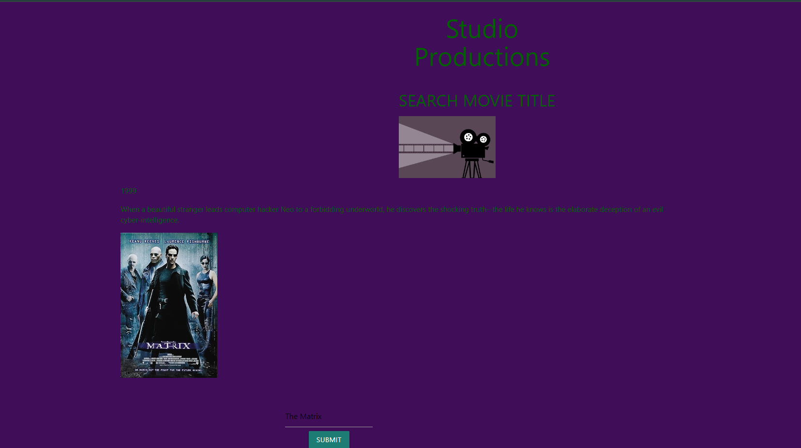
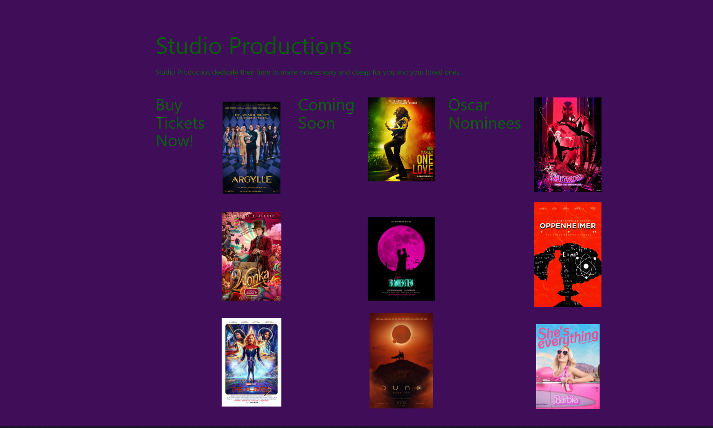

# Code-crusader
<!-- 
1. Make sure our local main branch is up to date with our remote main branch
    - 'git pull origin main' on the 'main' brnch
2. Create a new branch off the main branch (locally)
    - git checkout -b feature/{feauture-name}
    -feature/add-navaigation
    -feature/add-form
    -feature/style-hompage
    - BAD: feauture/Bob
3. Write our Code
- commit early
- commit often
- push to remote often
- make sure our work is small -- ideally the work on this branch should laste hours, not days.
4. Push our final working code to remote (github)
5. Open a Pull Request
6. Respond to comments and feedback
7. Merge our feature branch -> main branch
8. Delete our feature (optional) -->

Link to the site: https://kibarke.github.io/Code-crusader/

Studio Productions is a movie based website that allows users to see information based on the movie title they looked up.

### Sources
* Omdb API
* Tmdb API
* Tail Wind CSS

### Site Photos

